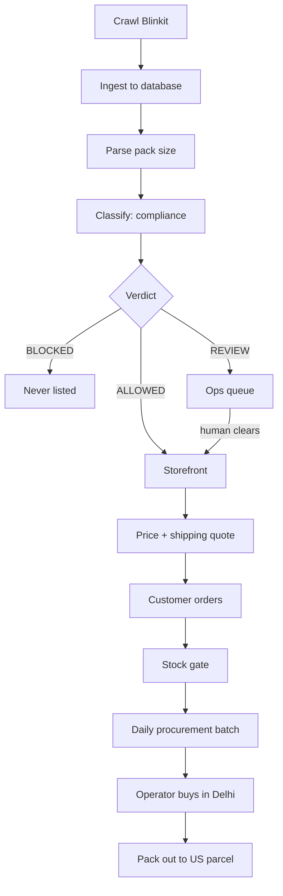
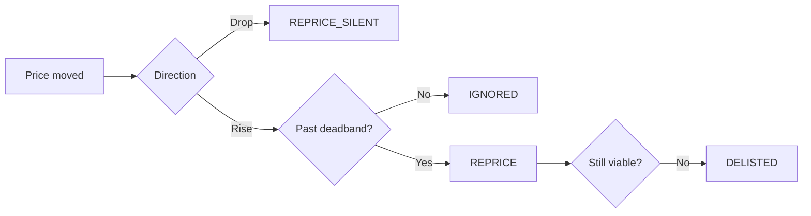

# Sourced — How The System Works

2026-09-20

## 1. What Sourced does

**In one sentence:** Sourced takes 31,366 grocery products scraped from an Indian quick-commerce app and works out which of them can legally, physically and profitably be sold to a customer in the United States — then carries the order through to someone buying it off a shelf in Delhi.

### The problem

Four decisions stand in front of every product:

| Question | Why it is hard |
| --- | --- |
| **May we ship it?** | A jar of ghee, a packet of seeds and a can of aerosol deodorant are three unrelated legal problems. Customs rules, FDA import alerts and airline dangerous-goods rules all apply, and none of them are written per product. |
| **Can we ship it?** | Carriers bill on weight, but the catalogue only says things like `2 x 100 g` or `100 pulls`. Get the weight wrong and you lose margin on every order forever. |
| **Should we ship it?** | A $4 bag of peanuts that costs $27 in freight is not a product. It is a polite way to lose money. |
| **Can we actually get it?** | The shelf price and the stock flag were true at the moment we crawled them. Neither is a promise about tomorrow. |

### The shape of the answer

**Nine engines**, each narrow and explainable. Every verdict traces to a specific rule, number and reason.

Current catalogue:

- **6,173 products listable** — cleared to sell
- **21,713 in review** — not rejected, just not yet cleared by a human
- **3,480 blocked** — a rule says no, with a citation

**Unknown is not safe.** A product matching no rule goes to review, never to the storefront. That is why review outnumbers listable 3:1.

## 2. How to read this document

Every component from section 5 onward is described with **the same five headings, in the same order**. Once you have read one component, you know how to read all of them.

| Heading | The question it answers |
| --- | --- |
| **Purpose** | What decision does this component make? One sentence. |
| **Input** | What does it need before it can decide? |
| **Logic** | How does it actually decide? The rules, thresholds and arithmetic. |
| **Output** | What comes out, and what downstream component consumes it? |
| **Where you see it** | The screen, file or API endpoint where this shows up in real life. |

Two conventions throughout: **fail closed** (when unsure, take the cautious branch) and **cite the authority** (every rejection names its legal instrument — `9 CFR 94`, `FDA Import Alert 53-19`, `IATA DGR UN1950`).

## 3. The pipeline, end to end

From scraped row to US doorstep.



### The eleven steps

1. **Crawl** — `crawl.py` reads Blinkit at \~0.635 req/s → `inventory_delhi.csv`
2. **Ingest** — normalise into `products` (31,366 SKUs)
3. **Parse pack** — `2 x 100 g` → 200 g
4. **Classify** — rule pack writes verdict + every rule that fired
5. **Cluster** — 21,713 review SKUs → 531 human decisions
6. **Clear** — operator works `/ops`; decisions stored as overrides
7. **List** — price from `pricing.py`, freight from `shipping.py`
8. **Basket** — add-on suggestions by freight arithmetic
9. **Gate** — stock re-verified synchronously at checkout
10. **Batch** — day's orders → Blinkit carts, split by dark store, risk-ordered
11. **Buy** — operator pick sheet with three confirmations

### The two loops that run alongside

- **Availability loop** — `availability_engine.py` re-checks stock on freshness tiers: cart items within 60 seconds, hot SKUs every 15 minutes, listed every 6 hours, the tail every 48 hours.
- **Drift loop** — `pricedrift.py` watches for shelf prices moving away from the snapshot and escalates `IGNORED → REPRICE → DELISTED`.

## 4. The data foundation

**Purpose.** Hold every fact the engines reason over in one database, so that any question — "why is this SKU not listed", "what did we quote that customer", "when did this go out of stock" — is answerable with a join rather than a guess.

**Input.** `inventory_delhi.csv` (8.5 MB), produced by `crawl.py` against Blinkit's Delhi catalogue on 16 September 2026.

**Logic.** `ingest.py` normalises each row, `packparse.py` resolves the pack size, and the result lands in `products`. Everything else in the database is derived from that table.

**Output.** `crossborder.db` — a single SQLite file, 28 MB, 18 tables.

**Where you see it.** Every screen. It is the only source of truth in the system.

### The 18 tables, grouped by what they are for

| Group | Tables | Holds |
| --- | --- | --- |
| **Catalogue** | `products` | The 31,366 scraped SKUs: name, brand, price, pack, shelf, merchant |
| **Verdicts** | `classifications`, `fired_rules`, `overrides` | What each SKU was judged, every rule that fired on it, and human decisions that outrank both |
| **Human work** | `review_queue` | The 531 clustered decisions an operator actually works |
| **Stock** | `stock_checks`, `stockout_risk`, `relist_queue`, `waitlist` | Availability readings, risk scores, back-in-stock candidates, who to notify |
| **Selling** | `customers`, `orders`, `order_lines`, `price_drift` | Who bought what, at what price, and whether that price has since moved |
| **Fulfilment** | `procurement_batches`, `batch_lines`, `batch_allocations`, `procurement_events` | The day's buying job, line by line, with a ledger of which unit belongs to which customer |

Two design choices: **every fired rule is kept** (`fired_rules` holds 38,546 rows — a SKU can trip several), and **human decisions live in `overrides`**, a separate table, so rebuilding the rule pack never discards an operator's work.

## 5. Pack parsing

`crossborder/packparse.py`

**Purpose.** Turn Blinkit's free-text pack description into a real number of grams, millilitres or pieces.

**Input.** The `unit` field as scraped — human copy, not data. Real examples from the catalogue: `2 x 100 g`, `1 pair`, `500 ml (Pack of 2)`, `1 kg`, `6 pcs`, `100 pulls`.

**Logic.** Three conversion tables and a multiplier rule.

1. **Mass words** map to grams: `kg` × 1000, `mg` × 0.001, `lb` × 453.592, `oz` × 28.3495.
2. **Volume words** map to millilitres: `l`, `ltr`, `litre` all × 1000.
3. **Count words** (about 60 of them — `pcs`, `pulls`, `wipes`, `sachets`, `diapers`) have no intrinsic mass, so they carry a piece count instead and borrow a weight assumption from the shelf defaults in `rules/shipping.yaml`.
4. **Multipliers** are applied: `2 x 100 g` becomes 200 g, not 100 g. `pair` counts as 2 objects and `dozen` as 12; every other count word is one object per unit.

**Output.** A `Pack` record with `net_g`, `net_ml`, `pieces` and — critically — a `confidence` of `high`, `medium` or `none`.

| Confidence | SKUs | Share | What it means |
| --- | --- | --- | --- |
| `high` | 30,421 | 97.0% | Parsed cleanly to a real quantity |
| `medium` | 445 | 1.4% | Parsed, but with an assumption |
| `none` | 500 | 1.6% | Could not be parsed at all |

**Where you see it.** Indirectly, in every shipping quote and every landed price. Directly, in the `net_g` / `pack_confidence` columns of `products`.

Freight is billed on weight, so a pack wrong by 20% makes every future quote wrong by 20%. Failure is therefore explicit: `confidence: none` is itself a review trigger, and assumed weights always **round upward**.

## 6. Compliance engine — how it decides

`crossborder/compliance.py` + `crossborder/rules/compliance.yaml`

**Purpose.** Decide whether a SKU may be listed on a US storefront, and record why.

**Input.** A product's name, brand, shelf, aisle and parsed pack.

**Logic.** Four layers of rules, evaluated by priority. Worst verdict wins. Every match is recorded.

**Output.** A verdict, the dimensions that caused it, a reason, and a citation.

**Where you see it.** `/ops`, and the `classifications` + `fired_rules` tables.

### The three verdicts

| Verdict | Meaning | Count |
| --- | --- | --- |
| `ALLOWED` | List it. | 6,173 |
| `REVIEW` | Do not auto-list. A human clears it once, and that decision is stored as an override so the SKU is never re-reviewed. | 21,713 |
| `BLOCKED` | Never list. Legal prohibition, or it physically cannot arrive intact. | 3,480 |

### The eight dimensions

Why a rule fired — lets ops triage the queue by cause.

| Dimension | What it means |
| --- | --- |
| `US_IMPORT` | Legal prohibition or restriction at the US border |
| `HAZMAT` | Dangerous goods — air carriers refuse it regardless of legality |
| `TEMPERATURE` | Needs a cold chain; will not arrive intact |
| `PERISHABLE` | Shelf life shorter than transit time |
| `FRAGILITY` | Breaks in transit |
| `FUNCTIONAL` | Legal and shippable, but will not work in the US (mains voltage) |
| `DUTY` | Admissible, but carries antidumping or high-duty exposure |
| `IP_RISK` | Counterfeit, grey-market or brand-authorisation exposure |

### The four rule layers

Most-specific first. Worst verdict wins; every match is recorded.

| Layer | Count | Matched against |
| --- | --- | --- |
| **Keyword** | 39 rules | Product name + brand, case-insensitive regex. Highest priority. |
| **Group** | 71 rules | Blinkit's shelves ("Jewellery", "Baby Toys & Gifts") |
| **Category** | 9 rules | Blinkit's broad aisles |
| **Pack** | 2 rules | Physical thresholds from the parsed pack |

### Scoping: the subtlety that makes this work

The same word means different things on different shelves — **cream** is dairy in grocery and moisturiser in beauty; **tablet** is medicine in pharma and a computer in electronics. Rules carry scope qualifiers (`scope_not_super`) to prevent this. Without them a single broad rule silently deletes thousands of listable SKUs — this happened in development, and `tests/test_crossborder.py` now locks it out.

### The commitment that shapes everything

`meta.review_default: true`

A SKU matching **no rule at all** goes to `REVIEW`, never to `ALLOWED`. This is why the review pile is three times the listable pile. It is not a backlog to be embarrassed about — it is the system refusing to sell anything nobody has looked at.

## 7. Compliance engine — the actual rules

Rule pack `2026.09.1`. Complete keyword layer, grouped by problem. `p` = priority, higher first.

### Animal products — the hardest US prohibitions

| Rule | p | Verdict | Authority |
| --- | --- | --- | --- |
| `KW-MEAT-001` | 100 | BLOCKED | 9 CFR 94; USDA APHIS Animal Product Manual |
| `KW-SEAFOOD-002` | 100 | BLOCKED | 21 CFR 123 (Seafood HACCP); NOAA Seafood Import Monitoring |
| `KW-EGG-003` | 100 | BLOCKED | 9 CFR 94.6; APHIS poultry restrictions |
| `KW-DAIRY-FRESH-010` | 95 | BLOCKED | 9 CFR 94.16 (milk products) |
| `KW-MILKPOWDER-011` | 94 | BLOCKED | 9 CFR 94.16; 21 U.S.C. 350a (Infant Formula Act) |
| `KW-GHEE-012` | 90 | REVIEW | 9 CFR 94.16; FDA Prior Notice 21 CFR 1.280 |

### Plants and seeds

| Rule | p | Verdict | Authority |
| --- | --- | --- | --- |
| `KW-POPPY-022` | 96 | BLOCKED | 21 U.S.C. 802 (Controlled Substances Act) |
| `KW-PRODUCE-020` | 95 | BLOCKED | 7 CFR 319.56 (Fruits and Vegetables) |
| `KW-SEED-021` | 95 | BLOCKED | 7 CFR 319.37 (Nursery Stock); 7 CFR 330.300 |

### Controlled and restricted goods

| Rule | p | Verdict | Authority |
| --- | --- | --- | --- |
| `KW-TOBACCO-030` | 100 | BLOCKED | 21 U.S.C. 387 (FDA Tobacco Control Act) |
| `KW-BETEL-031` | 100 | BLOCKED | FDA Import Alert 21-19 (areca nut) |
| `KW-ALCOHOL-032` | 100 | BLOCKED | 27 U.S.C. 203 (TTB Basic Permit); state ABC law |
| `KW-PHARMA-040` | 98 | BLOCKED | 21 U.S.C. 331/355 (FD&C Act) |
| `KW-AYURVEDA-041` | 92 | REVIEW | 21 U.S.C. 321(g) (drug definition) |
| `KW-SUPPLEMENT-042` | 88 | REVIEW | DSHEA 21 U.S.C. 350b; 21 CFR 101.36 |

### Dangerous goods — airlines refuse these regardless of legality

| Rule | p | Verdict | Authority |
| --- | --- | --- | --- |
| `KW-AEROSOL-050` | 99 | BLOCKED | IATA DGR UN1950; 49 CFR 173.306 |
| `KW-FLAMMABLE-051` | 99 | BLOCKED | IATA DGR Class 3/4.1; 49 CFR 172.101 |
| `KW-PESTICIDE-053` | 99 | BLOCKED | FIFRA 7 U.S.C. 136a; 40 CFR 152 |
| `KW-CORROSIVE-054` | 99 | BLOCKED | IATA DGR Class 8; 49 CFR 173.136 |
| `KW-BATTERY-055` | 94 | REVIEW | IATA DGR Packing Instruction 965-970 |
| `KW-PERFUME-052` | 93 | REVIEW | IATA DGR UN1266, Limited Quantity |
| `KW-MAGNET-056` | 90 | REVIEW | IATA DGR UN2807; 16 CFR 1262 (magnet sets) |

### Cold chain and shelf life

| Rule | p | Verdict | Authority |
| --- | --- | --- | --- |
| `KW-TOYINFOOD-063` | 99 | BLOCKED | 21 U.S.C. 342(d)(1); FDA Import Alert 34-02 |
| `KW-ICECREAM-060` | 97 | BLOCKED | Physical constraint; FDA 21 CFR 1.908 |
| `KW-FROZEN-061` | 97 | BLOCKED | Physical constraint; FSMA Sanitary Transport |
| `KW-FRESHSWEET-064` | 85 | REVIEW | Operational; APHIS dairy restrictions |
| `KW-CHOCOLATE-062` | 70 | REVIEW | Operational — commodity melting point |

### Cosmetics, drugs and devices

| Rule | p | Verdict | Authority |
| --- | --- | --- | --- |
| `KW-KAJAL-073` | 93 | BLOCKED | FDA Import Alert 53-19; 21 CFR 700.13 |
| `KW-SUNSCREEN-070` | 91 | REVIEW | 21 CFR 352 (Sunscreen Monograph) |
| `KW-OTCDRUG-071` | 89 | REVIEW | 21 CFR 355/350/333 (OTC monographs) |
| `KW-DEVICE-074` | 88 | REVIEW | 21 CFR 807 (Establishment Registration) |
| `KW-COSMETIC-072` | 75 | REVIEW | MoCRA 2022 (21 U.S.C. 364) |

### Consumer goods, electronics and trade

| Rule | p | Verdict | Authority |
| --- | --- | --- | --- |
| `KW-FCC-083` | 78 | REVIEW | 47 CFR Part 15/2.1033; FCC Form 740 |
| `KW-JEWELLERY-081` | 74 | REVIEW | 16 CFR 1500.91 (lead in children's jewelry) |
| `KW-TOY-080` | 72 | REVIEW | CPSIA 15 U.S.C. 2063; 16 CFR 1303 (lead paint) |
| `KW-VOLTAGE-082` | 86 | REVIEW | Operational — 230 V will not work on US mains |
| `KW-FRAGILE-084` | 60 | REVIEW | Operational constraint |
| `KW-HONEY-090` | 87 | REVIEW | US DOC Antidumping Order A-533-903 (Raw Honey) |
| `KW-IPRISK-091` | 65 | BLOCKED | 19 U.S.C. 1526; 15 U.S.C. 1124 (Lanham Act) |

### The category layer — 9 whole-aisle rules

| Aisle | Verdict | Dimension |
| --- | --- | --- |
| Chicken, Meat & Fish | BLOCKED | US\_IMPORT |
| Vegetables & Fruits | BLOCKED | US\_IMPORT |
| Dairy, Bread & Eggs | BLOCKED | TEMPERATURE |
| Ice Creams & More | BLOCKED | TEMPERATURE |
| Health & Pharma | REVIEW | US\_IMPORT |
| Electronics | REVIEW | US\_IMPORT |
| Stationery & Games | REVIEW | US\_IMPORT |
| Cleaners & Repellents | REVIEW | HAZMAT |
| Feminine Hygiene | **ALLOWED** | — |

Feminine Hygiene is the only aisle cleared wholesale — shelf-stable, non-hazardous, unrestricted.

### The group layer — 71 shelf rules

Blinkit's shelves judged as units: **29 ALLOWED, 24 BLOCKED, 18 REVIEW**. This layer does the bulk clearing.

### The pack layer — 2 physical rules

| Rule | Trigger | Verdict | Why |
| --- | --- | --- | --- |
| `PK-HEAVY-001` | Billable weight over 20 kg | REVIEW | Freight exceeds typical goods value, and the parcel may need formal customs entry rather than informal clearance (19 CFR 143.21, USD 2,500 limit) |
| `PK-UNKNOWN-002` | Pack string unparseable | REVIEW | Shipping weight cannot be computed, so quoting the SKU risks under-charging freight |

The rule pack states its own limit: these citations are *"our documented basis for a commercial decision, not legal advice; have a licensed customs broker sign off before you rely on it in production."*

## 8. Listability and the ops sheet

`crossborder/operator.py` → the `review_queue` table → the `/ops` screen

**Purpose.** Turn 21,713 unresolved SKUs into a day of human work that is actually finishable.

**Input.** Every SKU whose verdict is `REVIEW`.

**Logic.** Cluster by shelf × the rule that fired, then rank by how many SKUs each decision unlocks.

**Output.** 531 decisions. Each one clears an entire cluster.

**Where you see it.** `/ops` on the deployed site.

### The arithmetic that makes the queue workable

A per-SKU queue of 21,713 items is one nobody works. Clustering collapses it:

|  | Count |
| --- | --- |
| SKUs needing review | 21,713 |
| Clusters they collapse into | **531** |
| SKUs covered by the top 50 clusters | 12,862 (**59%**) |

Fifty decisions clear 59% of the backlog. Clearing `Jewellery / KW-JEWELLERY-081` alone moves **829 SKUs**.

### What is in the ops sheet — every column

| Column | What it holds | Example |
| --- | --- | --- |
| `cluster_id` | The unique key: shelf + rule | `Party & Festive Needs\|DEFAULT-REVIEW` |
| `group_name` | The Blinkit shelf | `Jewellery` |
| `rule_id` | Which rule sent it here | `KW-JEWELLERY-081` |
| `dimension` | Why — one of the eight | `US_IMPORT` |
| `reason` | Plain-language explanation | "No rule matched this SKU. Unknown items are held for review rather than listed." |
| `authority` | The citation to stand behind | `16 CFR 1500.91` |
| `sku_count` | How many SKUs this one decision moves | `829` |
| `sample_names` | Real product names, so the reviewer sees what they are judging | `'67' Trendy Rakhi by Ttyohar \| 0-9 Number Foil Balloon...` |
| `status` | `PENDING` or decided | `PENDING` |
| `decided_by` | Who decided | — |
| `decided_at` | When | — |
| `note` | Free text — the reasoning, for the next person | — |

The last four columns are empty across all 531 rows — **no clusters worked yet.**

### The ten biggest decisions waiting

| Shelf | Rule | Dimension | SKUs |
| --- | --- | --- | --- |
| Party & Festive Needs | `DEFAULT-REVIEW` | — | 834 |
| Jewellery | `KW-JEWELLERY-081` | US\_IMPORT | 829 |
| Jewellery | `GROUP:Jewellery` | US\_IMPORT | 775 |
| Home Needs | `DEFAULT-REVIEW` | — | 693 |
| Pooja Needs | `GROUP:Pooja Needs` | HAZMAT | 617 |
| Home Appliances | `GROUP:Home Appliances` | FUNCTIONAL | 575 |
| Fragrance & Talc | `KW-PERFUME-052` | HAZMAT | 535 |
| Beauty Accessories | `DEFAULT-REVIEW` | — | 517 |

`DEFAULT-REVIEW` means **no rule matched at all** — unexplored catalogue, and the cheapest wins on the board. Pooja Needs is flagged HAZMAT because camphor and incense are flammable solids, restricted on aircraft.

### How decisions survive rule changes

Cleared clusters write to `overrides`, which `classifications` does not touch. Rebuilding the rule pack rewrites every verdict, then re-applies overrides on top. Without this, every rule tweak would discard the previous week's work.

## 9. Pricing engine — landed cost

`crossborder/pricing.py` + `crossborder/rules/pricing.yaml`

**Purpose.** Turn an INR shelf price into a USD price a customer pays, with every cost line visible.

**Input.** Goods value in INR, the parsed weight, the shelf category, and a freight quote from section 10.

**Logic.** Eight lines, stacked in order. Every number lives in YAML — never in code.

**Output.** A rounded USD price plus a full cost breakdown, so when a SKU is unsellable you can see *which line* killed it.

**Where you see it.** Every price on the storefront; the `/api/quote` endpoint.

### The eight lines

```latex
\text{price} = \Big[(\text{goods} + \text{sourcing} + \text{freight} + \text{duty} + \text{MPF}) + \text{payments}\Big] \times (1 + \text{margin}) \rightarrow \text{round}
```

| # | Line | Value | Note |
| --- | --- | --- | --- |
| 1 | **Goods** | INR shelf price ÷ FX | FX held at 88.0 with a **2.5% buffer** over spot |
| 2 | **Sourcing** | ₹35 delivery + 2.0% handling + ₹45 pick/pack + **4.0% failure allowance** | The failure allowance covers orders where the SKU is gone on arrival |
| 3 | **Freight** | From the shipping engine | Billed on `max(actual, volumetric)` |
| 4 | **Duty** | 3.0%–8.5% by category, **6.0% default** | Chips 6.4%, sweets 8.5%, tea 3.2%, electronics 3.0% |
| 5 | **MPF** | 0.3464% of dutiable value | Floored at $2.62, capped at $634.62 |
| 6 | **Payments** | 2.9% + $0.30, plus 1.0% FX spread and 0.8% chargeback reserve | Stripe-class processing |
| 7 | **Margin** | Target **28%**, floor **15%** | Category overrides below |
| 8 | **Rounding** | To `.99`, minimum **$2.99** |  |

### Margin varies by category, deliberately

| Category | Margin | Reasoning |
| --- | --- | --- |
| Beauty & Cosmetics / Skin & Face | 38% | Light, high-value, non-perishable — freight is a small share |
| Home & Lifestyle | 34% |  |
| Stationery & Games | 32% |  |
| Chips & Namkeen | 22% | Bulky for their value |
| Atta, Rice & Dal | **18%** | Heavy and cheap — freight already dominates the price |

Staples carry the thinnest margin because freight already dominates the price.

### The de minimis line is set to zero, and that is not an oversight

```
de_minimis_usd: 0.0
de_minimis_note: "Section 321 suspended 2025; verify current CBP guidance
                  before relying on any exemption."
```

The $800 duty-free allowance is treated as unavailable — **every parcel is priced as dutiable**. If it returns, one number changes and every price updates.

### The viability check matters more than the price

Stops the system printing $50 for $4 of peanuts.

| Threshold | Value | Effect |
| --- | --- | --- |
| `max_freight_to_goods_ratio` | 4.0 | Freight over 4× goods value → not viable |
| `warn_freight_to_goods_ratio` | 2.0 | Freight over 2× → flagged |
| `min_goods_value_inr` | ₹40 | Below this, the SKU is not worth shipping alone |

A single cheap SKU runs **6.8×** freight ratio — commercially dead. An eight-item basket runs **2.7×** at 30.8% margin. That gap is why the basket builder exists.

## 10. Shipping engine

`crossborder/shipping.py` + `crossborder/rules/shipping.yaml`

**Purpose.** Turn a cart into a chargeable weight, then into one quote per carrier that will actually accept the parcel.

**Input.** The cart's parsed weights, plus any handling flags the compliance engine attached.

**Logic.** Build the billable weight, then run it through each carrier's slab table, then exclude carriers that cannot honour the handling flags.

**Output.** A ranked list of quotes.

**Where you see it.** Checkout, and the `/api/quote` endpoint.

### Step 1 — the billable weight

The rate table is easy. **Weight is hard.**

| Factor | Value | What it is |
| --- | --- | --- |
| `weight_factor` | × 1.18 | Dimensional allowance — groceries are bulkier than they are heavy |
| `box_tare_g` | + 260 g | The box itself |
| `fragile_extra_g` | + 180 g | Extra protective packing |
| `insulated_extra_g` | + 420 g | Thermal liner |
| `min_billable_g` | 500 g floor | No parcel bills under half a kilo |
| `min_item_g` | 18 g floor | Per item, so tiny SKUs cannot round to zero |

Carriers bill `max(actual, volumetric)`. Because the catalogue only ever gave free-text pack strings, **unknown weights always resolve upward** — every under-estimated gram is margin lost on every order forever.

### Step 2 — the five carriers

| Carrier | Service | Transit | Max | First 500 g | Fuel | Tracking |
| --- | --- | --- | --- | --- | --- | --- |
| DHL Express Worldwide | express | 3–6 d | 30 kg | ₹2,650 | +28.5% | full |
| FedEx International Priority | express | 4–7 d | 30 kg | ₹2,780 | +27.0% | full |
| Aramex Priority Parcel | express | 5–9 d | 30 kg | ₹2,150 | +24.0% | full |
| India Post International EMS | economy | 10–21 d | 20 kg | ₹1,350 | — | limited |
| Consolidated Air Freight (3PL) | consolidated | 8–15 d | 50 kg | ₹1,180 (first kg) | — | full |

Rates are **slab-based, not linear**: a flat base below 1 kg, then a declining per-kg rate as the parcel gets heavier. DHL charges ₹1,850/kg in the 1–2 kg band but ₹1,020/kg above 10 kg.

### Step 3 — the exclusion rule

This is the important design decision. Each carrier declares which handling flags it `accepts`:

| Carrier | Accepts |
| --- | --- |
| DHL, FedEx | `FRAGILE_PACK`, `INSULATED_PACK`, `VOLTAGE_MISMATCH`, `SHELF_LIFE_CHECK` |
| Aramex | `FRAGILE_PACK`, `VOLTAGE_MISMATCH`, `SHELF_LIFE_CHECK` — **no insulated handling** |
| India Post EMS | `VOLTAGE_MISMATCH` only |

A carrier that cannot honour a required flag is **excluded from the quote entirely — not ranked cheaper**. A cheap carrier that melts your chocolate is not an option, so it is never shown as one.

Rates are indicative published retail. Replace `rules/shipping.yaml` with contracted rates — no code changes. `LiveRateProvider` is the seam for a carrier API.

## 11. Stock and availability

`crossborder/stock.py` + `availability_engine.py`

**Purpose.** Know whether a SKU can actually be bought right now, and refuse to sell it when the answer is uncertain.

**Input.** Readings from Blinkit, stored in `stock_checks`.

**Logic.** Two layers — a background refresh on freshness tiers, and a hard synchronous gate at checkout.

**Output.** A boolean, plus the age of the reading.

**Where you see it.** The in-stock badge on the storefront; the block at checkout.

### Why this needs two layers

Blinkit's limit is \~**0.635 req/s** — a full pass over 31,366 SKUs would take 13+ hours. So the budget goes where it matters.

### Layer 1 — freshness tiers

| Tier | Re-check every | Why |
| --- | --- | --- |
| `cart` | **60 seconds** | Someone is about to buy it |
| `hot` | 15 minutes | High demand or high risk |
| `listed` | 6 hours | On the storefront |
| `tail` | 48 hours | Everything else |

Driven by the scheduler in `availability_engine.py`.

### Layer 2 — the checkout gate

Every line is re-verified **synchronously, before money moves**. And it **fails closed**: a stale or unknown reading blocks the order exactly like a known out-of-stock. The system would rather lose a sale than take money for something it cannot buy.

### Availability is a boolean, not a count

Blinkit exposes an in-stock flag, not depth. So no "12 left" badge — that number would be fabricated.

### The switch that matters for the live demo

```
stock:
  require_live_confirmation: false
```

Right now this is **off**, which means checkout sells against the snapshot and blocks only items already marked out of stock. Turning it on makes the gate strict — but it requires a live Blinkit session, which needs a real machine in India with a visible browser. See section 17 for what that means in practice.

## 12. Stockout risk

`crossborder/stockout_risk.py`

**Purpose.** Predict which SKUs are about to become unbuyable, so procurement buys them first.

**Input.** Current stock flag, the shelf's historical out-of-stock rate, discount depth, and — once history accumulates — flip frequency and restock latency.

**Logic.** A weighted score from 0 to 1, with weights renormalised over whatever signals actually exist.

**Output.** A score, a bucket, a confidence, and a plain-language explanation. Currently scored for **27,886 SKUs**.

**Where you see it.** Pick-sheet ordering; the risk column in `/console`.

### The six signals and their weights

| Signal | Weight | Available on day one? |
| --- | --- | --- |
| Currently out of stock | **0.40** | Yes |
| Shelf base rate | **0.25** | Yes |
| Flip frequency | 0.15 | Only after history accrues |
| Restock latency | 0.10 | Only after history accrues |
| Deep discount | 0.05 | Yes |
| Never seen in stock | 0.05 | Yes |

### Buckets and the sale block

| Threshold | Value | Effect |
| --- | --- | --- |
| `critical` | ≥ 0.75 | Highest priority on the pick sheet |
| `high` | ≥ 0.50 | Elevated |
| `block_sale_above` | **0.90** | The SKU is not sold at all |

### The honesty mechanism

This engine has an unusual property: **it tells you when it does not know.**

| Confidence | Requires |
| --- | --- |
| `high` | 14+ observation runs |
| `medium` | 4+ runs |
| `low` | Fewer than 4 |

With no history, every score reports `low` — a ranking hint, not a prediction. The shelf base rate carries real weight immediately and genuinely discriminates: **18%** out-of-stock on Toys & Games versus **92%** on Baby Toys & Gifts.

**Weights renormalise** when a signal is missing, so absence never drags a score toward "safe" — which is what scoring absent signals as zero would do.

### Every score is explainable

```
CRITICAL (0.91, low confidence):
  currently out of stock  +0.40
  shelf base rate         +0.23
```

## 13. Procurement and batching

`crossborder/procurement.py` + `crossborder/operator.py`

**Purpose.** Turn a day of US orders into a handful of Blinkit baskets someone in Delhi can actually buy, then put the goods back into per-customer parcels.

**Input.** All orders placed before the daily cutoff.

**Logic.** Consolidate, split by dark store, order by risk, and keep a ledger of who owns each unit.

**Output.** Procurement batches with a pick sheet per merchant.

**Where you see it.** `/console`, and the operator view at `/operator`.

### The batching limits

| Setting | Value | Why |
| --- | --- | --- |
| `cutoff_ist` | **23:00 IST** | The daily line under which orders are batched |
| `max_lines_per_cart` | 40 | A Blinkit cart has practical limits |
| `max_value_per_cart_inr` | ₹15,000 | Keeps a single failure from being catastrophic |
| `max_qty_per_sku` | 6 | Buying 40 of one item draws attention and empties the shelf |
| `split_by_merchant` | true | Mandatory — see below |
| `priority_first` | true | Risk-ordered picking |

### The four things that make it work

**1. Consolidation with a ledger.** Three customers ordering the same peanuts become one line of qty 3; `batch_allocations` records which unit belongs to whom. Without the ledger a short has no owner.

**2. Split by dark store first.** One basket, one merchant. The listable catalogue spans `34280` (3,700 SKUs) and `36778` (2,396), so a day's batch is never a single order.

**3. Risk-first pick order.** Lines are bought in descending stockout risk, weighted by the USD revenue riding on them. Buy the thing most likely to vanish, on which the most money depends, first.

**4. Completeness-first shorts.** When 2 of 3 units arrive they go to the orders closest to whole. One shippable order plus one refund beats three half-orders, none of which can move.

### Why order placement is not automated

A deliberate boundary, not a missing feature. Placing a Blinkit order needs an authenticated account, a cart-write endpoint, a saved address and a payment authorisation — the project holds none. `session_delhi.json` carried only geolocation and analytics cookies; `discover.py` captured three **read** templates. The hard blocker is payment: Indian card and UPI require RBI-mandated 2FA on a human's device by design.

### So the operator gets a job reduced to a few taps

`operator.py` produces a risk-ordered pick sheet with a deep link per line (`/prn/<slug>/prid/<id>`, built from stored fields with a search fallback), plus **three API-free confirmations**:

1. A typed **price attestation** — catches the wrong-pack-size mis-pick before it ships
2. Quantity reconciliation against the batch line
3. Pack-out confirmation per parcel

The system does the thinking; a human does the buying.

## 14. Price drift

`crossborder/pricedrift.py`

**Purpose.** Notice when a Blinkit shelf price has moved away from the price the storefront is built on, and decide what to do about it.

**Input.** Fresh price readings versus the listed snapshot price.

**Logic.** Two separate thresholds, because two different things are being protected.

**Output.** An action on a three-step ladder.

**Where you see it.** The `price_drift` table; the drift panel in `/console`.

### Two thresholds, not one

| Threshold | Value | Protects |
| --- | --- | --- |
| **List drift** | greater of **$3.00 or 5%** | The catalogue's general accuracy |
| **Quote drift** | **$2.00 or 4%** | A named customer who was promised a specific price |

The list threshold uses *the greater of* a dollar amount and a percentage: a flat $3 is 12% on a $25 item but 2.5% on a $120 one. Quote drift is held tighter, and the engine **enforces that invariant in code** rather than trusting the YAML.

### The ladder



**Drops never block an order** — cheaper goods proceed, price quietly corrected. Only rises escalate, and a rise past viability delists rather than selling at a loss. A price move that helps you is not an incident.

| Setting | Value |
| --- | --- |
| `drop_action` | `REPRICE_SILENT` |
| `rise_action` | `REPRICE` |
| `delist_when_unviable` | `true` |
| `reprice_batch_size` | 500 |

## 15. Restock and Basket

Two smaller engines, same framework.

### Restock — `crossborder/restock.py`

**Purpose.** Decide when a SKU that came back into stock is actually safe to put back on the site.

**Input.** Stock readings over time, plus the SKU's compliance verdict and viability.

**Logic.** Three gates between "Blinkit has it" and "list it".

**Output.** A recommendation in `relist_queue` — never an automatic action.

**Where you see it.** The relist panel in `/console`.

| Gate | Setting | What it stops |
| --- | --- | --- |
| **Stability hold** | `stability_hours: 6` | In stock for ten minutes means nothing |
| **Flap suppression** | `max_flips_per_day: 3`, `flap_suppress_hours: 48` | A SKU oscillating several times a day is noise, not news |
| **Re-check** | compliance + viability | The rules or the economics may have changed while it was gone |

Two deliberate restraints:

- `auto_relist: false` — relisting is **recommended, never automatic**.
- `waitlist_notify_cap: 5` — telling 200 people an item is back when a handful of units exist manufactures 194 complaints.

### Basket — `crossborder/basket.py`

**Purpose.** Suggest add-ons that make the cart's freight arithmetic work.

**Input.** The current cart, its billable weight, and the catalogue.

**Logic.** Freight arithmetic — explicitly *not* "customers also bought".

**Output.** Up to 6 suggestions.

**Where you see it.** The cart page on the storefront.

The highest-leverage engine: a single cheap SKU carries a **6.8×** freight ratio and is commercially dead; an eight-item basket runs **2.7×** at 30.8% margin.

**Free headroom** is the core insight: carriers bill rounded weight, so a 1.05 kg cart already bills at 1.5 kg and the next **450 g ship for nothing**.

Four guards keep the suggestions sane:

| Guard | Setting | Why |
| --- | --- | --- |
| **Value density** | `min_value_density_inr_per_g: 1.25` | The catalogue spans 25,000× — saffron at ₹615/g to erasers at ₹0.025/g |
| **Procurement-aware** | `require_in_stock: true`, `max_risk_score: 0.6` | A suggestion that fails procurement costs more than no suggestion |
| **One dark store** | `prefer_same_merchant: true` (+0.25 bonus) | A cross-merchant add-on silently creates a second Blinkit order with a second delivery fee |
| **Relevance guard** | `max_price_ratio: 1.5` | Pure arithmetic recommends a $197 watch beside ₹93 of chana |

The relevance guard matters most: unconstrained freight math recommends a $197 watch beside ₹93 of chana.

## 16. The four surfaces

Everything runs as **one application on one address**. The engines are not separate services — they are Python modules that execute server-side when a page or an endpoint asks them to.

| Surface | Live URL | Who uses it | What it shows |
| --- | --- | --- | --- |
| **Storefront** | [baba-it.onrender.com/](https://baba-it.onrender.com/) | Customers | Catalogue, product pages, cart, checkout. Prices from the pricing engine, freight from shipping, suggestions from the basket builder. |
| **Control tower** | [/console](https://baba-it.onrender.com/console) | You | Runs pipeline stages by hand, seeds demo data, simulates orders, shows every engine's state. |
| **Compliance queue** | [/ops](https://baba-it.onrender.com/ops) | Reviewer | The 531 clustered decisions from section 8. |
| **Pick sheet** | [/operator](https://baba-it.onrender.com/operator) | Buyer in Delhi | Risk-ordered lines, deep links, three confirmations. |
| API reference | [/docs](https://baba-it.onrender.com/docs) | Developers | All 47 endpoints, interactive. |
| Old storefront | [/legacy](https://baba-it.onrender.com/legacy) | — | The earlier single-page version. |

### The control tower is where the system explains itself

`/console` makes the pipeline visible as stages you run one at a time:

| Endpoint group | What it does |
| --- | --- |
| `/api/ops/pipeline/ingest` | Load the CSV into the database |
| `/api/ops/pipeline/classify` | Run the compliance rules |
| `/api/ops/pipeline/llm` | Run the LLM tail classifier (optional) |
| `/api/ops/pipeline/risk` | Score stockout risk |
| `/api/ops/pipeline/restock` | Evaluate relist candidates |
| `/api/ops/pipeline/drift` | Check for price movement |
| `/api/ops/demo/prime-stock` | Seed stock readings |
| `/api/ops/demo/seed-orders` | Create sample orders |
| `/api/ops/demo/simulate-buys` | Simulate customer purchases |
| `/api/ops/fulfil/build-pending` | Build the day's procurement batch |
| `/api/ops/fulfil/oneclick` | Run the whole fulfilment path |

### The LLM tail — optional by design

`crossborder/llm.py` handles the roughly 28% of SKUs no rule covers. It batches and deduplicates by shelf signature (about **179 API calls for 8,909 SKUs**) and returns a verdict **plus a confidence**. Anything below **0.80 still goes to a human**.

Without `ANTHROPIC_API_KEY` it returns nothing and the tail stays in `REVIEW`. **The pipeline degrades; it does not fail.**

## 17. What is real, and what is a snapshot

What to say in a demo, before being asked.

### Real — computes live, per request

All nine engines execute on every order. Change a YAML rule and the next quote reflects it. Not recordings.

### A snapshot — fixed at crawl time

The product catalogue. 31,366 SKUs imported from `inventory_delhi.csv`, crawled on **16 September 2026**. Names, prices, shelves and the stock flags are all as they stood that day.

Refreshing it needs `crawl.py` / `discover.py`, which require a real machine in India with a visible browser — not a code limitation, but what the source expects to see.

### The three consequences, stated plainly

| Consequence | Detail |
| --- | --- |
| **No live availability feed** | Checkout sells against the snapshot and blocks only items already flagged out of stock. To make it strict: run `availability_engine.py` against a live session and set `procurement.yaml → stock.require_live_confirmation: true` |
| **Risk confidence is `low` everywhere** | The `stock_checks` table is empty, so flip frequency and restock latency have nothing to work with. Scores are ranking hints, as section 12 says outright |
| **No orders have been placed yet** | `orders`, `batch_lines` and `overrides` are all empty. The fulfilment engines are built and tested, but have not yet run on real traffic |

### One thing to know about the deployment

The database lives on the host's ephemeral disk. **Anything written at runtime — orders, ops decisions, overrides — is wiped on the next deploy.** That is fine for a demo, but real operational work needs a persistent disk or a move to Postgres before it can be trusted to survive.

**In short:** a complete decision system running on a frozen catalogue. The reasoning is real and inspectable; the products are a photograph.

## 18. Glossary

| Term | Meaning |
| --- | --- |
| **SKU** | One sellable product. The catalogue has 31,366 |
| **Shelf / group** | Blinkit's narrow product grouping, e.g. "Jewellery". 261 of them |
| **Aisle / category** | Blinkit's broad grouping, e.g. "Electronics". 28 of them |
| **Dark store** | The physical warehouse fulfilling a Blinkit order. Identified by merchant ID |
| **Merchant ID** | Which dark store stocks a SKU. The listable catalogue spans `34280` and `36778` |
| **Verdict** | `ALLOWED`, `REVIEW` or `BLOCKED` — the compliance answer for one SKU |
| **Dimension** | *Why* a rule fired — one of the eight risk categories |
| **Authority** | The legal citation a verdict rests on |
| **Cluster** | A group of SKUs sharing a shelf and a fired rule. One decision clears all of them |
| **Override** | A human decision stored separately, so it survives rule-pack rebuilds |
| **Rule layer** | Keyword, group, category or pack — evaluated most-specific first |
| **Scope qualifier** | A restriction stopping a rule firing in the wrong aisle (`scope_not_super`) |
| **Pack confidence** | `high`, `medium` or `none` — how well the pack string parsed |
| **Billable weight** | What the carrier charges on: `max(actual, volumetric)`, plus packaging |
| **Volumetric weight** | Weight derived from parcel size rather than mass |
| **Landed cost** | Every cost between the Indian shelf and the customer's card |
| **De minimis** | The duty-free threshold. Set to **$0** here — Section 321 is treated as suspended |
| **MPF** | Merchandise Processing Fee. 0.3464% of dutiable value, floor $2.62, cap $634.62 |
| **Viability** | Whether freight is small enough versus goods value to be worth selling |
| **Freight ratio** | Freight ÷ goods value. Above 4.0 is not viable |
| **Value density** | Goods value per gram. The catalogue spans 25,000× |
| **Free headroom** | Weight you can add before the next billing slab — goods that ship for nothing |
| **Freshness tier** | How often a SKU's stock is re-checked: cart 60 s, hot 15 min, listed 6 h, tail 48 h |
| **Fails closed** | When uncertain, take the cautious branch. The system's core habit |
| **Flap suppression** | Ignoring a SKU that flips in and out of stock too often to be signal |
| **Stability hold** | Requiring 6 hours of continuous stock before relisting |
| **Consolidation** | Merging identical lines across customers into one purchase line |
| **Allocation ledger** | The record of which purchased unit belongs to which customer |
| **Completeness-first** | Giving short stock to the orders closest to whole |
| **Price attestation** | The operator typing the price they actually paid, catching mis-picks |
| **List drift** | Catalogue price movement. Threshold: greater of $3 or 5% |
| **Quote drift** | Movement against a price promised to a named customer. Held tighter: $2 or 4% |
| **LLM tail** | The \~28% of SKUs no rule covers, optionally classified by a model |
| **Rule pack** | The versioned set of compliance rules. Currently `2026.09.1` |

## 19. Links

### Live system

| What | Link |
| --- | --- |
| Storefront | https://baba-it.onrender.com/ |
| Control tower | https://baba-it.onrender.com/console |
| Compliance queue | https://baba-it.onrender.com/ops |
| Operator pick sheet | https://baba-it.onrender.com/operator |
| API reference (47 endpoints) | https://baba-it.onrender.com/docs |
| Old storefront | https://baba-it.onrender.com/legacy |

First request after idle takes 30–50 seconds — the host spins the service down between visits, and the catalogue is a 28 MB database.

### Source

| What | Link |
| --- | --- |
| Repository | https://github.com/sanyamgaur/Scrapper |
| This document (Markdown) | [`SYSTEM-EXPLAINER.md`](https://github.com/sanyamgaur/Scrapper/blob/main/SYSTEM-EXPLAINER.md) |
| Getting started | [`START-HERE.txt`](https://github.com/sanyamgaur/Scrapper/blob/main/START-HERE.txt) |
| Engine notes | [`crossborder/README.md`](https://github.com/sanyamgaur/Scrapper/blob/main/crossborder/README.md) |

### The rule packs

Every threshold in this document lives in one of these four files. Change policy here, never in code.

| Engine | File |
| --- | --- |
| Compliance (sections 6–8) | [`rules/compliance.yaml`](https://github.com/sanyamgaur/Scrapper/blob/main/crossborder/rules/compliance.yaml) |
| Pricing (section 9) | [`rules/pricing.yaml`](https://github.com/sanyamgaur/Scrapper/blob/main/crossborder/rules/pricing.yaml) |
| Shipping + customs (sections 9–10) | [`rules/shipping.yaml`](https://github.com/sanyamgaur/Scrapper/blob/main/crossborder/rules/shipping.yaml) |
| Stock, risk, procurement, drift, restock, basket (sections 11–15) | [`rules/procurement.yaml`](https://github.com/sanyamgaur/Scrapper/blob/main/crossborder/rules/procurement.yaml) |

### Engine source

| Section | Module |
| --- | --- |
| 5. Pack parsing | [`packparse.py`](https://github.com/sanyamgaur/Scrapper/blob/main/crossborder/packparse.py) |
| 6–7. Compliance | [`compliance.py`](https://github.com/sanyamgaur/Scrapper/blob/main/crossborder/compliance.py) |
| 8. Ops queue | [`operator.py`](https://github.com/sanyamgaur/Scrapper/blob/main/crossborder/operator.py) |
| 9. Pricing | [`pricing.py`](https://github.com/sanyamgaur/Scrapper/blob/main/crossborder/pricing.py) |
| 10. Shipping | [`shipping.py`](https://github.com/sanyamgaur/Scrapper/blob/main/crossborder/shipping.py) |
| 11. Stock | [`stock.py`](https://github.com/sanyamgaur/Scrapper/blob/main/crossborder/stock.py) · [`availability_engine.py`](https://github.com/sanyamgaur/Scrapper/blob/main/availability_engine.py) |
| 12. Stockout risk | [`stockout_risk.py`](https://github.com/sanyamgaur/Scrapper/blob/main/crossborder/stockout_risk.py) |
| 13. Procurement | [`procurement.py`](https://github.com/sanyamgaur/Scrapper/blob/main/crossborder/procurement.py) |
| 14. Price drift | [`pricedrift.py`](https://github.com/sanyamgaur/Scrapper/blob/main/crossborder/pricedrift.py) |
| 15. Restock · Basket | [`restock.py`](https://github.com/sanyamgaur/Scrapper/blob/main/crossborder/restock.py) · [`basket.py`](https://github.com/sanyamgaur/Scrapper/blob/main/crossborder/basket.py) |
| 16. API · console | [`api.py`](https://github.com/sanyamgaur/Scrapper/blob/main/crossborder/api.py) · [`console.py`](https://github.com/sanyamgaur/Scrapper/blob/main/crossborder/console.py) |
| 16. LLM tail | [`llm.py`](https://github.com/sanyamgaur/Scrapper/blob/main/crossborder/llm.py) |
| 17. Scraper | [`crawl.py`](https://github.com/sanyamgaur/Scrapper/blob/main/crawl.py) · [`discover.py`](https://github.com/sanyamgaur/Scrapper/blob/main/discover.py) |

### On the legal citations

The authorities in section 7 (`9 CFR 94`, `FDA Import Alert 53-19`, `IATA DGR UN1950` and the rest) are quoted from the rule pack and are **not linked here** — they were not fetched or verified against the issuing bodies while writing this document. Look each one up at [ecfr.gov](https://www.ecfr.gov) or [fda.gov](https://www.fda.gov) before relying on it, and have a licensed customs broker sign off, as the rule pack itself says.
